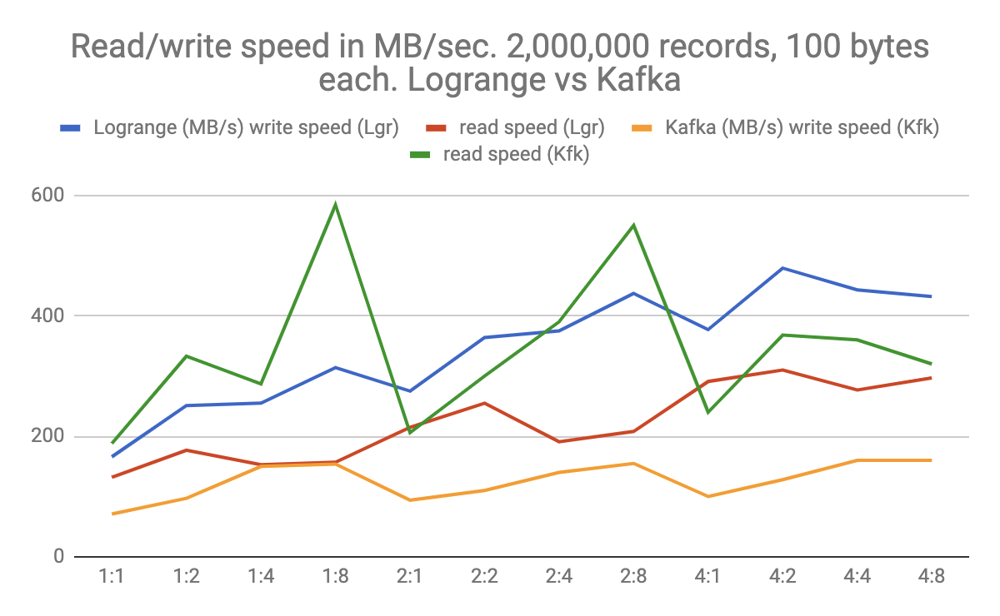
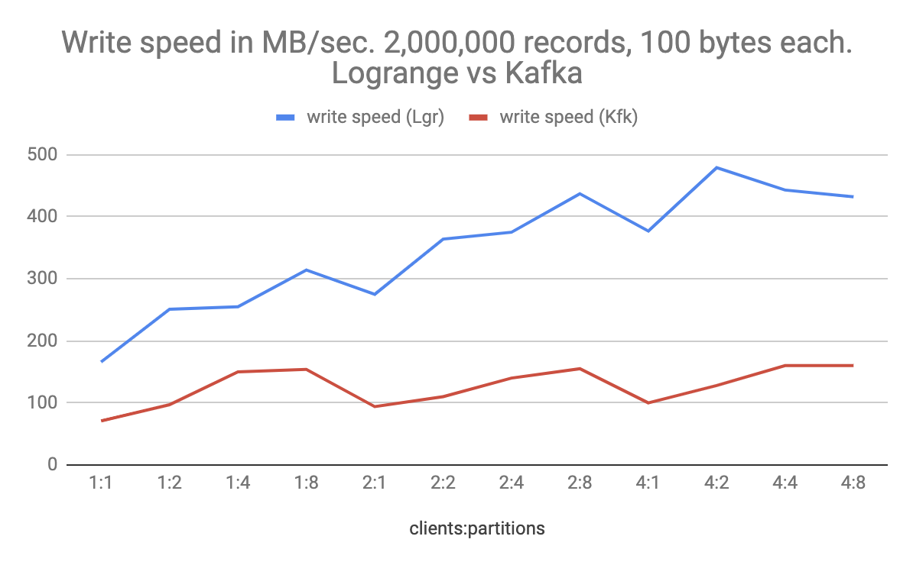
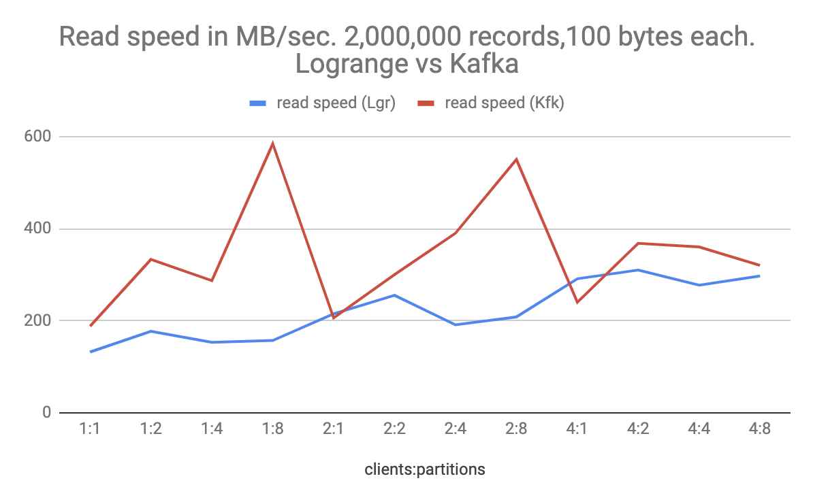
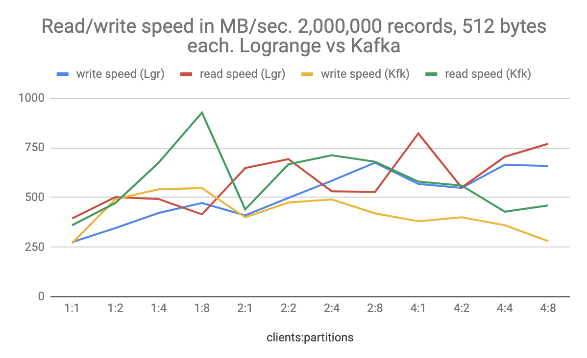
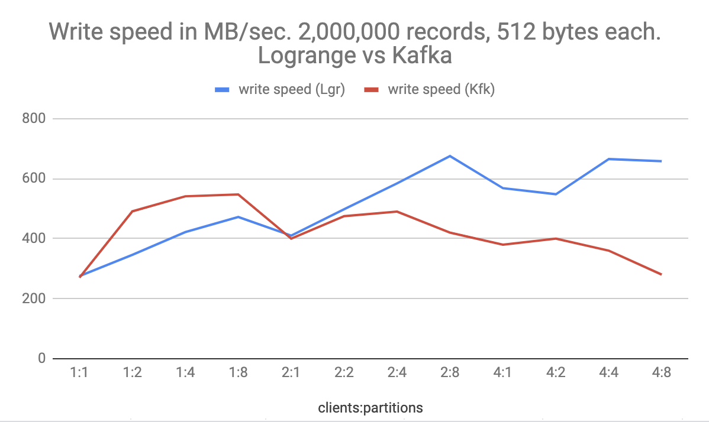
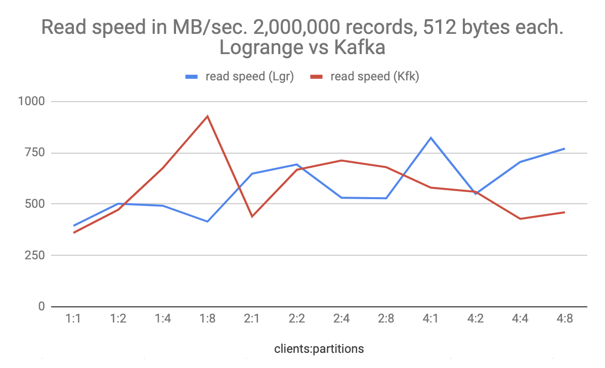

# Benchmarking Logrange: Millions of records per second in stand-alone configuration
_June 21, 2019 by Dmitry Spasibenko, Konstantin Babushkin_

The intention of this blog post is to present an idea of the Logrange performance. This is the first type of such tests where we try to evaluate its performance. To give the received numbers some sense, we needed to compare them with "something". This "something" became Apache Kafka in a single node configuration. Our goal was not to compare Logrange with Apache Kafka, but use Kafka numbers for interpretting Logrange ones.  

## What is Logrange?
[Logrange](https://github.com/logrange/logrange) is an open-source streaming database for aggregating application logs, metrics, audit logs and other machine-generated data from thousands of sources.

Logrange works with data records that are kept in its database in writing order. Records are written into partitions, analogues of data tables in relational databases. Logrange is designed to store data in thousands of partitions, which eventually could be distributed across a cluster of machines. Partitions are identified by tags, a set of key-value pairs, so every partition has an unique combination of tags within one database.

A write operation allows to store one or many records into a partition of the Logrange database. For now Logrange supports synchronous write operations with confirmation only. It means that every write is confirmed and it guarantees that the data will be available to read if the write operation was executed successfully. 

Logrange supports [LQL](../docs/lql.md) for requesting data from one or multiple partitions. 

## The performance test
To test Logrange performance we've used MacBookPro with the following configuration:
```
Model Name:             MacBook Pro
Model Identifier:       MacBookPro15,2
Processor Name:         Intel Core i7
Processor Speed:        2.7 GHz
Number of Processors:   1
Total Number of Cores:  4
L2 Cache (per Core):    256 KB
L3 Cache:               8 MB
Memory:                 16 GB
```

The computer has SSD drive with `256Gb` capacity. When the tests were run, we tried to have at least `100Gb` of the disk space available, cleaning data periodically and rerunning the tests.

We spent several hours on tuning Kafka, which was run in a single-node configuration with no compression. The test-code for Kafka was written in Java, because the client in GoLang did not show better results compared to the Java client.

Each test-run included 1, 2, or 4 clients (processes) which opened connections to one of the systems. The clients created 1, 2, 4 or 8 java-threads/go-routines which wrote 2,000,000 records to a Logrange partition or to a Kafka topic. Every one of the thrads/go-routines had dedicated partition/topic. All records were either `100` or `512` bytes each.

Clients and the tested system (Kafka or Logrange) were run on the same machine, so the network was not envolved, and all the connections were established through the network loopback. 

We ran the test scenario several times with different settings and recorded the results in the tables below.

### Test results for 100 bytes records
Every client wrote `2,000,000` records to a topic/partition and then read them back. So the thread wrote `2Gb` of the data and then read it back immediately. The table below contains read/write-results in __Megabytes__ per second. Each row contains the result of the test run for Logrange and Kafka. In the first column we have a pair of numbers e.g. `2:4`, where the first number `2` contains the number of clients (processes), and the second number `4` shows the number of concurrent write/read operations performed on different partitions. The number of clients (`2` in the example) also shows how many connections were opened to the system:

Clients:partitions | Logrange (write) | Logrange (read) | Kafka (write) | Kafka (read)
--- | --- | --- | --- | ---
1:1	|166|	132|	71|	188
1:2|	251|	177|	97|	333
1:4|	255|	153|	150|	287
1:8|	314|	157|	154|	584
2:1|	275|	215|	94|	206
2:2|	364|	255|	110|	300
2:4|	375|	191|	140|	390
2:8|	437|	208|	155|	550
4:1|	377|	291|	100|	240
4:2|	479|	310|	128|	368
4:4|	443|	277|	160|	360
4:8|	432|	297|	160|	320

Looking at the table at row `2:4` we see, that Logrange wrote records with the speed `375Gb/sec`, but read them back at `191Gb/sec`. Kafka writes and reads with  `140Gb/sec` and `390Gb/sec` respectively.

The data from the table could be visualy represented in the picture:



#### Write operations comparison



#### Read operations comparison



### Test results for 512 bytes records
When we wrote and read 2 million records, but with `512bytes` each, the result became better for both of the systems:

Clients:partitions | Logrange (write) | Logrange (read) | Kafka (write) | Kafka (read)
--- | --- | --- | --- | ---
1:1| 	275| 	394| 	270| 	360
1:2| 	346| 	502| 	491| 	472
1:4| 	422| 	492| 	541| 	675
1:8| 	472| 415| 	547| 	927
2:1| 	410| 	648| 	400| 	440
2:2| 	498| 	693| 	475| 	667
2:4| 	584| 	531| 	490| 	712
2:8| 	675| 	528| 	420| 	680
4:1| 	568| 	822| 	380| 	580
4:2| 	548| 	550| 	400| 	560
4:4| 	665| 	705| 	360| 	428
4:8| 	658| 	770| 	280| 	460

The table visualization:


#### Write operations comparison



#### Read operations comparison



## Interpretting the results
Both systems deomonstrated significantly high speeds of writing and reading data, which seems to be caused by the speed of the SSD disk where the data was actually stored. The disk Speed Test showed the speed of writing data around `1100Mb/sec` and the data read is about `2200Mb/sec`. Also we observed some test result volatility within 5% of the result fluctuation, which is most probably caused by the disk write/read performance. 

For both systems we observed significant CPU load, which was around 370% for both systems when multiple write/reads are performed concurrently. Logrange and Kafka demonstrated very high speeds of writing data (`~650Mb/sec`), which looks very good, comparing to the maximum pure disk write speed (`~1100Mb/sec`).

Kafka in general, shows relatively high speeds of reading data. We assumed this could be caused by the queries structure (Logrange supports [LQL](../docs/lql.md) ) and the schema, which is used by Logrange for the records. Each record has 2 mandatory fields `ts` and `msg` and some optional fields, which were not filled during the tests. 

Taking into account the maturity of Kafka and some features that we have in Logrange, the test results look very good and pretty optimistic. 

The speed of wrting data `437Mb/sec` means that system would be able to write about `4.37` millions of records (100 bytes each) per second. For the read operations we observed numbers like `822Mb/sec` for records of `512` bytes each. The speed says that the sytem would be able to return more than `1.6 millions` of such records per second on read requests. 

### Talk to us!
If you want to learn more about Logrange and its use cases, take a look at our [website](https://logrange.io). 

If you need to have all logs from your system in one place, please do not hesitate to [contact us](https://www.logrange.io/#contact-us) or send us an email (mail@logrange.io).
