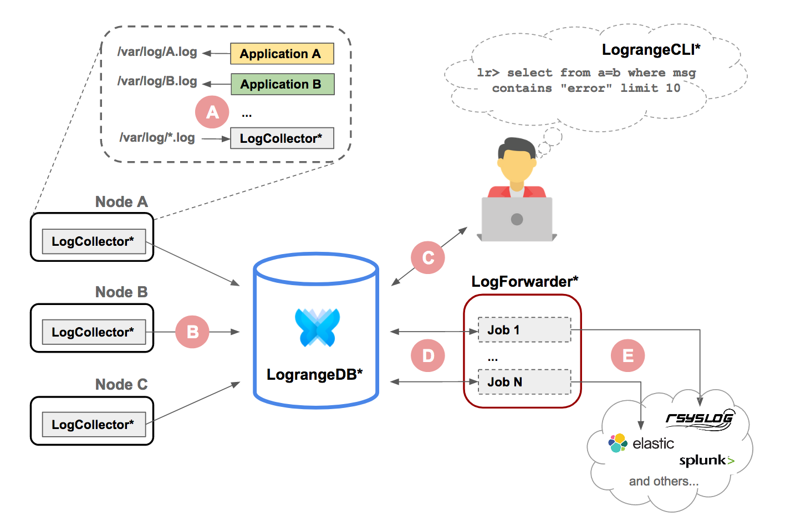

## Use case: Log Management

_May 23, 2019 by Konstantin Babushkin_

### What is Log Management?

Log management is a process of handling applications' logs, which consists of: log collection, aggregation, storage, rotation and providing means of information retrieval from the aggregated logs for further processing (e.g. analysis, alerting, forwarding to 3rd party system etc). 

#### Why it is important?

Logs can provide an important insight of what is happening with an application. Without logs companies would have much less understanding of their applications' behavior in production and ways to figure out if there have been any problems, security breaches or anomalies in activity.

#### Why it is not easy?

Modern applications may have hundreds of servers running and interacting with each other in a very convoluted ways. The application clusters may scale up and down, run in a different geographical regions, be deployed in virtualized and containerized environments. In such a dynamic and complex environments applications' logs handling is far from being easy. Just to store the volumes of logs the modern applications produce requires gigabytes or even terabytes of disk space per day. Logs should be collected from hundreds of machines and stored securely, reliably and in such a manner that provides effective way of information retrieval for further processing.

Log Management raises a lot of challenges, describing which is out of scope of this post, but at this point it should already be obvious that Log Management is not an easy task.
      
#### Existing solutions and problems

Log Management task is not new and there are numerous tools and platforms out there to address it in one way or another. We're not going to describe each of them here, let us just mention several very common problems we see in the existing solutions.

- Leading solutions require a lot of money per gigabyte of storage (while SSD is reasonably cheap nowadays), which is besides being simply unacceptable for many customers also rises a question of how good these solutions fit for Log Management.

- Free text indexing solutions are not suitable for storing big amounts of logs, because it's getting very resource expensive in terms of supporting those indexes as data amount grows fast.

- Cloud native solutions besides having the same problems as others do also are not deployable on premises, which can be a real problem for big organizations with strict security compliance requirements.

The aforementioned problems often forces people to compromise the way how they do Log Management of their applications. For example, they store only "important" logs and for a short period of time, which rarely is an optimal strategy in Log Management...

### Logrange database as Log Management system

Logrange database is built from the very beginning to work with streaming data. Logs seem to fit very well under the definition of streaming data. Logrange doesn't do unnecessary free text indexing or other kind of preprocessing which is expensive, instead it tries to save streams as fast as possible and provide effective tools for further work with the stored streams (for more info about Logrange read [Introducing Logrange](https://www.logrange.io/blog/introduction.html)).

Taking all the above into account, we at Logrange developed a set of auxiliary tools (log collector, forwarder, etc) which makes it easy to use Logrange database as a full-featured and inexpensive Log Management system.

#### How it works

The solution has the following key components (marked with asterisk (*) on the diagram above):

- **LogCollector** - logs collecting agent, collects log data **(A)** on a given source (node, VM, container) and sends it **(B)** to LograngeDB;

- **LograngeDB** - Logrange database, aggregates all the collected logs and provides an interface for querying that data.

- **LograngeCLI** - command line tool, provides a way to run different kind of queries **(C)** against LograngeDB (e.g. in order to analyse the collected log data).

- **LogForwarder** - logs forwarding agent, queries logs **(D)** from LograngeDB and sends them **(E)** to a 3-rd party system. This is optional feature which could be used if for some reason partially or all the aggregated data should be sent to 3-rd party system for further analysis.

#### Installation

One can try out Logrange based Log Management system right now, by following a few simple steps. Ready to use out-of-the-box, just choose the type of installation you need (below) and follow the instructions.

- [Standalone installation](https://github.com/logrange/logrange#quick-start)

- [Kubernetes installation](https://github.com/logrange/k8s#logrange-k8s-installation)

#### Conclusion

While Logrange database (as of the time of writing the post) is still under active development, we're confident that Log Management system based on Logrange database makes a lot of sense. This approach takes into account streaming nature of logs and allows to solve the problems mentioned in this post for other Log Management solutions.
