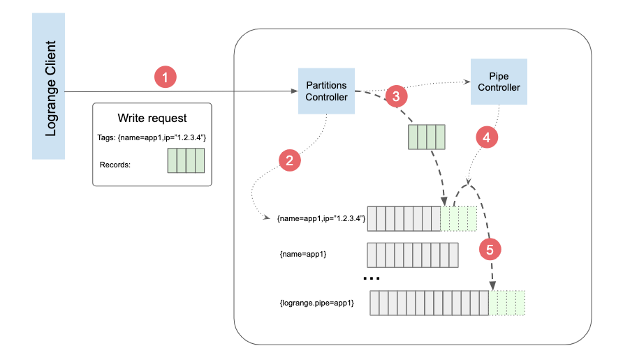
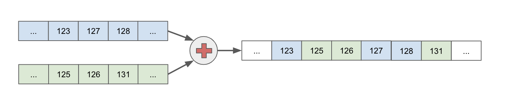
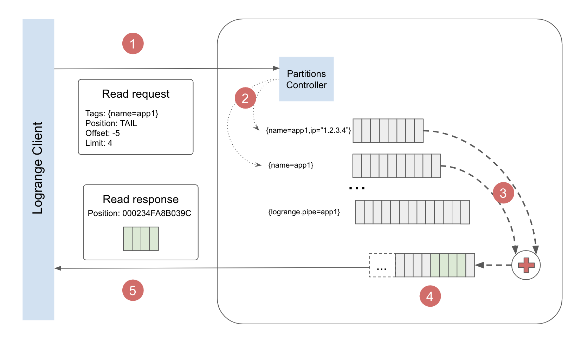

# Logrange Concepts
This document contains main concepts which are essential to understand how Logrange works. 
 
## Introduction to Logrange database
Logrange is a streaming database. The "streaming database" part in this phrase means that Logrange is intended to work with streams of records.

A stream is a sequence of records, which is persisted in a partition. Partition is like a table in relational database, but with immutable records. Logrange allows to keep data in tens of thoursands of partitions and it is optimized for adding new records in fast and efficient manner. 

 
## Data record
Data record is an array of bytes. The size of record (number of bytes in the array) could be in the range `[0..16384]` (up to 16KB). A record could be 0 length.
 
## Stream of records
Logrange works with streams of records. Stream is an ordered, immutable sequence of records. Records could be appended to a stream:

```
HEAD                                  TAIL
  +--------------------------------------+      +----+
  | R0 | R1 | R2 | R3 | R4 | R5  R6 | R7 |   <- | R8 |
  +--------------------------------------+      +----+
```
 
Records in the stream, could be read, but not updated. New records are always added to the end of the stream, so any stream has FIFO (First-In, First-Out) record access method. 

The first record in a stream is named 'HEAD' and the last known one is a 'TAIL'. Any new record in the stream is always append to the tail.
 
### Record Position
Each record in a stream has its position, so any record could be addressed by the record position. The position is encoded into text and usually seems like senseless for human read. The examples could be `0000AB12FD093413` or `479ADF00EC938:123409EEE0091` etc. 
 
The records positions could be copy-pasted to be used in different queries to start reading from the position. They must not be modified by user and provided by Logrange for referring to a record in a stream. 
 
## Tags 
Tag is a key-value pair with text representation for both key and the value. A tag could be written by `name=application1` or better to quote the value like `name="application number 1"`
 
Tags are comma-separated tag values e.g. `name="app1",ip="27.3.2.1"`. Logrange often requires to provide tags in curly braces, so Tags are written in the following form `{name="app1",ip="27.3.2.1"}`
 
Tags are used for naming streams, partitions.
 
## Partition
_Partition_ is a persisted stream of records with unique combination tags applied to it. An analogy of partition could be a table of records in a relational database or collection of records in an NoSQL database. 
 
In Logrange every partition has unique combination of tags. For instance, this 3 combinations of tags are unique, even some tags could be same, or one combination is a subset of an another one:
```
{name="app1",ip="27.3.2.1"}
{name="app1"}
{ip="27.3.2.1"}
```
So this 3 combinations of tags are unique, so each of them can address a specific partition.
 
## Write operation
Write operation is a process of appending one or more records into ONE partition. Write always specifies the target partition where the records to be appended to. Write operation has the following attributes:
- _partition tags_ - which uniquely identify the destination of the records
- _records_ - a set of the records which should be written to the partition

If the partition with the combination of tags doesn't exist, it will be created by the write operation. 

In case of multiple writes happen to the same partition at the same time, the records could be shuffled. 
 
Example. Two operations `W1` and `W2` applied simultaneously for a partition `P`:
```
1. Before writes: P=[R0, R1, R2, R3]
2. Two writes happened at the same time: W1=[A0, A1, A2], W2=[B0, B1, B2, B3] 
3. After the writes, one of the possible result: P=[R0, R1, R2, R3, B0, A0, A1, B1, B2, B3, A2]  
```
Logrange guarantees that in the result of a batch write operation `W`: 
1. All the records from W will be appended after the all records from the partition, which were there before the write operation. 
2. The records from the write operation W will appear in the partition in the same order as they were written there. 
 
## Pipe
_Pipe_ is a mechanism by which records from a write operation could be also written to another partition.
 
A Pipe has the following attributes:
- _Name_. A pipe unique name provided by user. 
- _Source filter_. This is a condition, which will be applied to tags of a write operation. In case of the condition is true, the pipe operation will be triggered. 
- _Records filter_. This is a condition which will be applied to every record from write operation. Only records that meet the criteria, will be written into the destination pipe. 

Every write operation to any partition is checked against knonwn pipes. A pipe is triggered if its _source filter_ matches tags from the write operation `W`. The triggered pipe allows to write one or all records from `W` to the partition tagged by `{logrange.pipe=<pipe name>}`

Example. Let's suppose that we have the pipe configured (JSON format is used here for visualization purposes):
```
Pipe: {
    Name:"pipe1", 
    SrcFilter: "name != '' ",
    RecordsFilter: ""
}
```
For the example the pipe will duplicate any operation `W`, which is applied to a partition with a non-empty `name` tag. All records from `W` will be written to the partition tagged by `{logrange.pipe=<pipe name>}` as well. 
 
 ### Write request example
 The following picture visualizes data writing process:
 
 On the picture the following steps are depicted:
 1. A Write operation request is sent by a client
 2. Partition Controller parses the request and looks for partition tagged by `{name="app1",ip="1.2.3.4"}`. In the example the partition already exists and contains some data. If the partition doesn't exist the Partition Controller will create it.
 3. Partition Controller writes records from the request into the partition. It also notifies Pipe Controller about the write operation. Pipe Controller checks whether there is a pipe for duplicating the write operation into another partition.
 4. Pipe Controller has found a pipe which requires to duplicate the write operation into another partition `{logrange.pipe="app1"}`. Pipe Controller initiate the writing process.
 5. The portion of the data written into partition `{name="app1",ip="1.2.3.4"}` is copied to the partition `{logrange.pipe="app1"}`

## Read operation
_Read Operation_ intended to obtain records from one or many partitions. Opposed to a Write operation the Read one can read records from multiple partitions. Some stream merge will be needed this case. 

Any Read operation requires the following parameters:
- _Tags condition_ is a logical expression which identifies which partitions should be selected for the read operation.
- _Start point_ or position in the resulted stream of records, from where records should be read.
- _Filter_ a records filtering condition.
- _offset_ specify a number of how many records should be skipped from the _start point_. Negative value makes sens and means roll back from the starting point towards to the head of the resulting stream.
- _limit_ the maximal number of records that can be returned in the request result.

### Tags condition
_Tags condition_ is a logical expression which identifies which partitions should be selected for the read operation. It could be written in one of the following 2 forms:
1. Simple form. 
2. Logical expression form

#### Tags condition. Simple form
In this form the list of tags, that must be in a partition tags is provided. For example the expression `{name="app1",ip="57.43.3.4"}` means - all partition with both tags `name="app1"` AND `ip="57.43.3.4"`. So partition tagged by `{name="app1",pod="1234",ip="57.43.3.4"}` matches the condition, but the partition with tags `{name="app1",pod="1234"}` does not.

#### Tags condition. Logical expression
This form allows to specify an expression using boolean `AND`, `OR` and `NOT` conditions. For tags matching logical expressions and some glob comparisons are available. For example, the condition `name like "app*" OR pod="1234"` allows to select all partitions, which have tag `name` with value started from "app", OR a partition with tag `pod="1234"` value.

### Merging result stream
Tags condition allows to select more than one partition for read. This case the result must be merged. Merge makes sense if reocrds have some field values which could be compared. For example, if Log events are stored in Logrange database, records have mandatory timestamp field, so the resulted stream, which consists of records from both streams, will be merged using the timestamp value. 


On the picture there are 2 streams of records are merged by the timestamps values (relative numbers in boxes)

### Records filtering
Filtering of records could be applied in case of an encoding is used. For example, if Log events are stored in Logrange database, records have mandatory field `msg` which contains the log message. The field could be used in a logical expression to filter some messages. The condition could be `msg contains "ERROR"` what will select only records that contain word 'ERROR' in the message body.

### Position
Position allows to specify a starting record in the result stream where result set of records should be read. There are 2 special positions 'HEAD' - for reading from the beginning of result stream and 'TAIL' for starting from the last record could be used. If the position is something in the middle of the stream, the value usually is not human readable, has some hash style and can be obtained as a result of some previous read operations.

### Read operation example
 The following picture visualizes data reading process:

The read operation consists of the following steps:
1. Read request is received and parsed by Partitions Controller.
2. 2 Partitions were found, which match to the tags criteria `{name="app1"}`
3. The result stream could be built by merging the 2 selected partitions
4. The first record in the result stream has offset -5 records from the tail. 
5. Result is composed and sent to the client as the read response. The read response contains the position of the next record which could be read from the result stream.


 